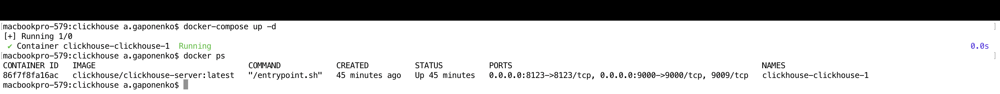
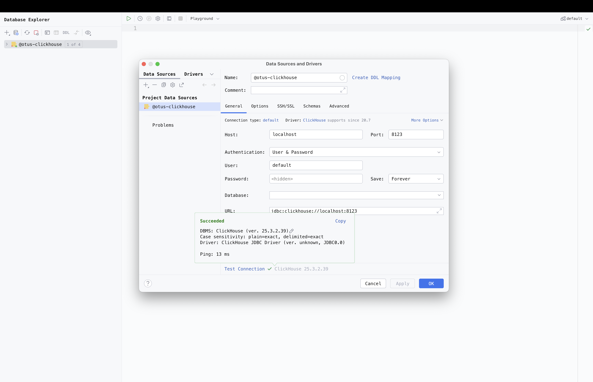
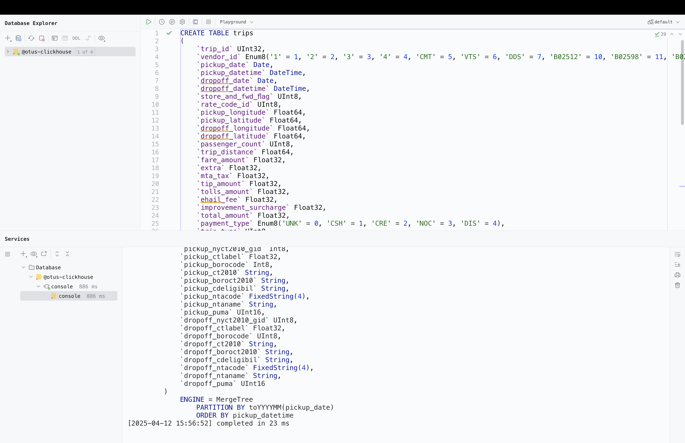

1. Запускаем clickhouse в docker
```bash
docker-compose up -d
docker ps
```


2. Настраиваем подключение в data-grip


3. Создаём таблицу запросом из https://clickhouse.com/docs/tutorial



---

SET log_queries = 1;

SELECT
'query1' as query_id,
pickup_ntaname,
toHour(pickup_datetime) as pickup_hour,
SUM(1) AS pickups
FROM trips
WHERE pickup_ntaname != ''
GROUP BY pickup_ntaname, pickup_hour
ORDER BY pickup_ntaname, pickup_hour;

SELECT query, query_duration_ms
FROM system.query_log
WHERE type = 'QueryFinish' and query LIKE '%query1%'
ORDER BY event_time DESC
LIMIT 5;