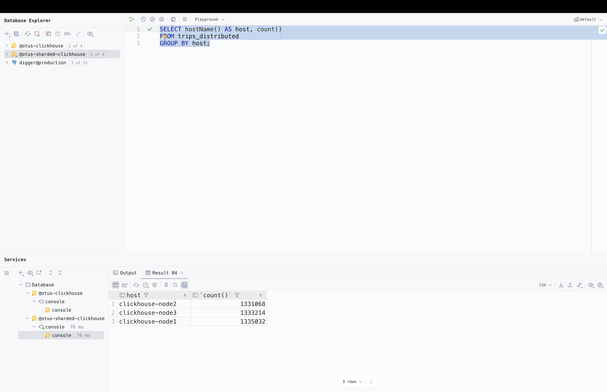
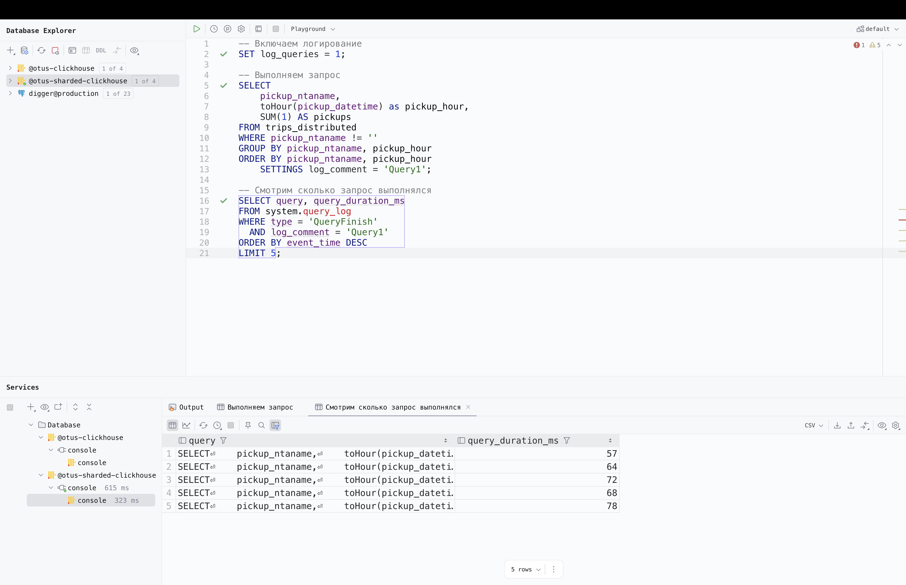

## 1. Запускаем clickhouse в docker
```bash
docker-compose up -d
docker ps
```


## 2. Настраиваем подключение в data-grip


## 3. Создаём таблицу

Запросом из https://clickhouse.com/docs/tutorial


## 4. Загружаем данные

Запросом из https://clickhouse.com/docs/tutorial


## 5. Выполним первый запрос

Посчитаем дневное кол-во поездок по районам и часу посадки

Выполним запрос 5 раз и посмотрим сколько он выполнялся


## 6. Выполним второй запрос

Посчитаем среднюю стоимость в зависимости от числа пассажиров

Выполним запрос 5 раз и посмотрим сколько он выполнялся


## 7. Поднимаем кластер clickhouse из 3х шардов


## 8. Проверяем наличие кластера


## 9. Создаём таблицу на всех нодах


## 10. Создаём Distributed таблицу


## 11. Вставляем данные в trips_distributed


## 12. Проверяем распределение данных 



## 13. Выполним первый запрос



## 14. Выполним второй запрос

