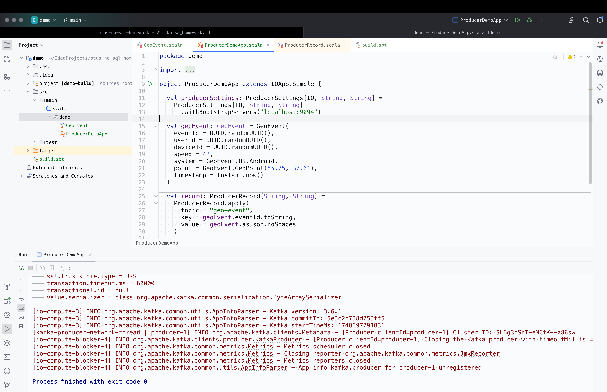
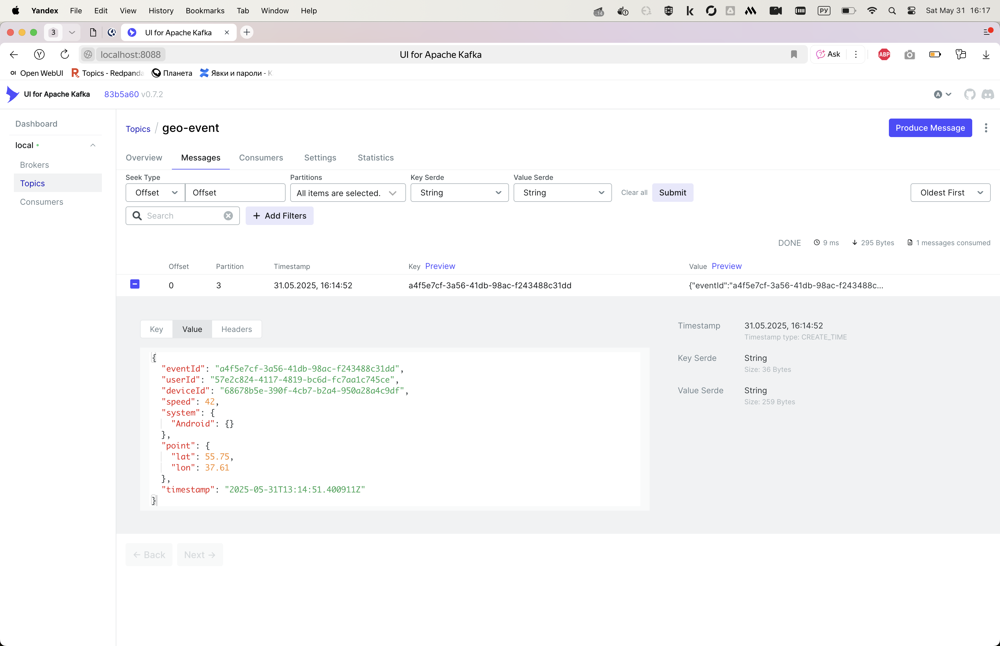

## 1. Запускаем kafka в docker

```bash
docker-compose up -d
docker ps
```


## 2. Открываем kafka-ui, создаём топик
`

## 3. Пишем сообщение kafka-console-producer


## 4. Проверяем наличие сообщения в kafka-ui


## 5. Читаем сообщение kafka-console-consumer


## 6. Создаём топик geo-event


## 7. Программно пишем GeoEvent


## 8. Проверяем наличие сообщения в kafka-ui


## 9. Программно читаем GeoEvent
