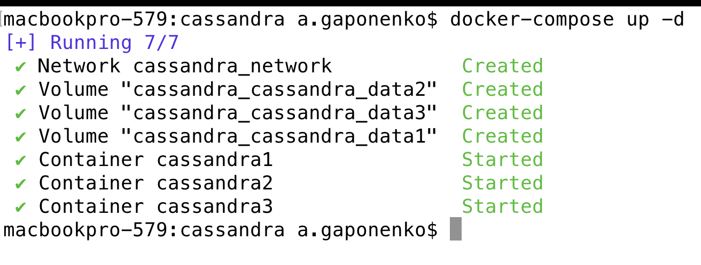
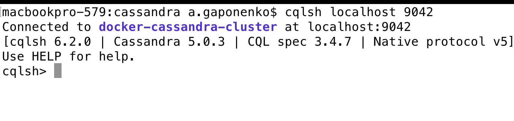
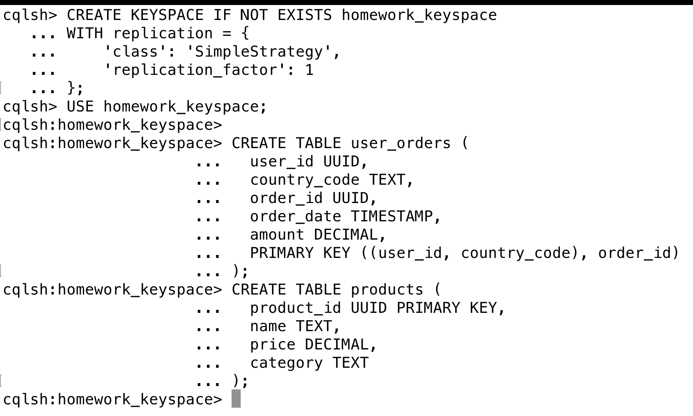
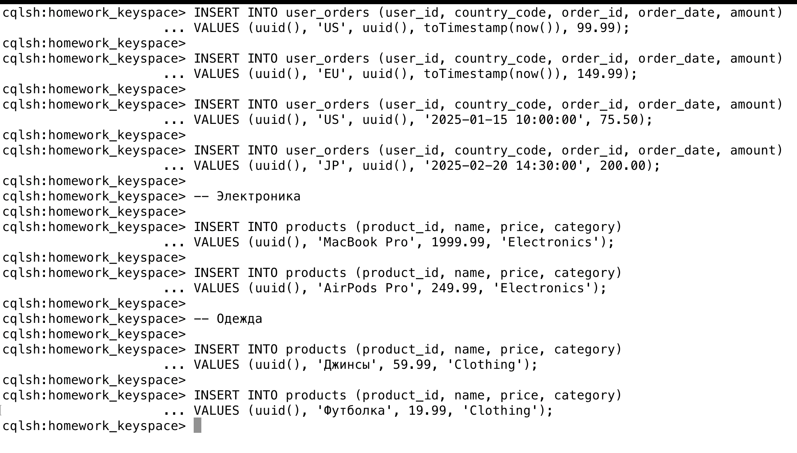
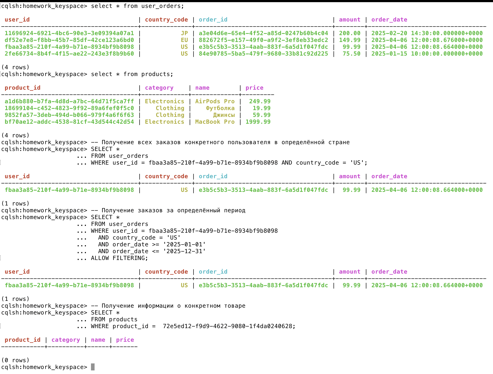
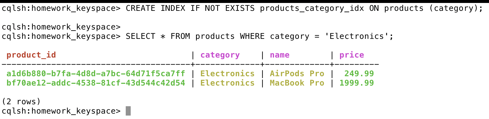

1. Поднимаем кластер

```bash
docker-compose up -d
```


2. Коннектимся к кластеру
```bash
cqlsh localhost 9042
```


3. Создаём keyspase с 2-мя таблицами
```cassandraql
CREATE KEYSPACE IF NOT EXISTS homework_keyspace
WITH replication = {
    'class': 'SimpleStrategy',
    'replication_factor': 1
};
USE homework_keyspace;

CREATE TABLE user_orders (
  user_id UUID,          
  country_code TEXT,     
  order_id UUID,         
  order_date TIMESTAMP,  
  amount DECIMAL,
  PRIMARY KEY ((user_id, country_code), order_id)
);

CREATE TABLE products (
  product_id UUID PRIMARY KEY,
  name TEXT,
  price DECIMAL,
  category TEXT
);
```


4. Заполним таблички данными
```cassandraql

INSERT INTO user_orders (user_id, country_code, order_id, order_date, amount) 
VALUES (uuid(), 'US', uuid(), toTimestamp(now()), 99.99);

INSERT INTO user_orders (user_id, country_code, order_id, order_date, amount) 
VALUES (uuid(), 'EU', uuid(), toTimestamp(now()), 149.99);

INSERT INTO user_orders (user_id, country_code, order_id, order_date, amount) 
VALUES (uuid(), 'US', uuid(), '2025-01-15 10:00:00', 75.50);

INSERT INTO user_orders (user_id, country_code, order_id, order_date, amount) 
VALUES (uuid(), 'JP', uuid(), '2025-02-20 14:30:00', 200.00);

-- Электроника

INSERT INTO products (product_id, name, price, category)
VALUES (uuid(), 'MacBook Pro', 1999.99, 'Electronics');

INSERT INTO products (product_id, name, price, category)
VALUES (uuid(), 'AirPods Pro', 249.99, 'Electronics');

-- Одежда

INSERT INTO products (product_id, name, price, category)
VALUES (uuid(), 'Джинсы', 59.99, 'Clothing');

INSERT INTO products (product_id, name, price, category)
VALUES (uuid(), 'Футболка', 19.99, 'Clothing');
```


5. Делаем запросики с WHERE
```cassandraql
-- Получение всех заказов конкретного пользователя в определённой стране
SELECT * 
FROM user_orders 
WHERE user_id = fbaa3a85-210f-4a99-b71e-8934bf9b8098 AND country_code = 'US';

-- Получение заказов за определённый период
SELECT * 
FROM user_orders
WHERE user_id = fbaa3a85-210f-4a99-b71e-8934bf9b8098
  AND country_code = 'US'
  AND order_date >= '2025-01-01'
  AND order_date <= '2025-12-31'
ALLOW FILTERING;

-- Получение информации о конкретном товаре
SELECT * 
FROM products
WHERE product_id =  72e5ed12-f9d9-4622-9080-1f4da0240628;
```


6. Создаём вторичный индекс на category
```cassandraql
CREATE INDEX IF NOT EXISTS products_category_idx ON products (category);
SELECT * FROM products WHERE category = 'Electronics';
```
